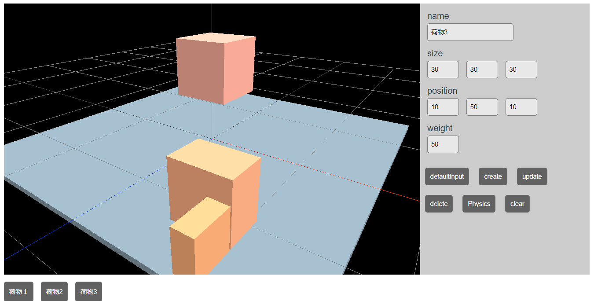

# Loading-Simulator-threejs

You can simulate the placement of luggage.

 

Using cannon-es, it is possible to set the weight of the luggage and perform physical calculations to ensure that the load does not fall after it has been placed.

 


## Project setup
```
npm install
```

### Compiles and hot-reloads for development
```
npm run serve
```

### Compiles and minifies for production
```
npm run build
```

### Lints and fixes files
```
npm run lint
```

### Customize configuration
See [Configuration Reference](https://cli.vuejs.org/config/).
